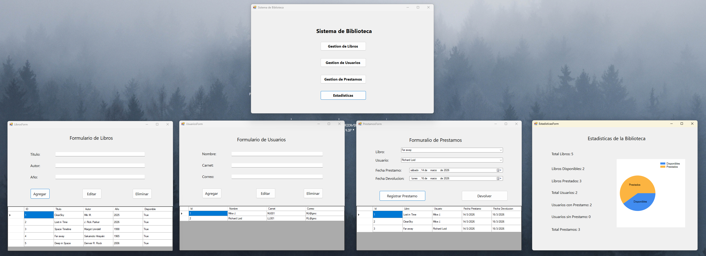

# BibliotecaApp

Sistema de gestión de biblioteca desarrollado en **C# Windows Forms**.

## Demo del sistema

## Funcionalidades

El sistema permite gestionar los elementos principales de una biblioteca:

- Gestión de libros
  - Agregar libros
  - Editar libros
  - Eliminar libros

- Gestión de usuarios
  - Registrar usuarios
  - Editar usuarios
  - Eliminar usuarios

- Gestión de préstamos
  - Registrar préstamo de libros
  - Registrar devolución de libros
  - Validación de disponibilidad de libros

- Estadísticas del sistema
  - Total de libros
  - Libros disponibles
  - Libros prestados
  - Total de usuarios
  - Usuarios con préstamo
  - Usuarios sin préstamo
  - Total de préstamos

- Visualización gráfica de estadísticas mediante gráficos.

## Tecnologías utilizadas

- C#
- Windows Forms
- .NET
- Git y GitHub

## Estructura del proyecto

El sistema está compuesto por los siguientes formularios:

- **MainForm**
  - Pantalla principal del sistema

- **LibrosForm**
  - Gestión de libros

- **UsuariosForm**
  - Gestión de usuarios

- **PrestamosForm**
  - Registro de préstamos y devoluciones

- **EstadisticasForm**
  - Visualización de estadísticas del sistema

## Control de versiones

El desarrollo del proyecto se realizó utilizando **Git** con ramas de funcionalidad:

- `feature/libros`
- `feature/usuarios`
- `feature/prestamos`
- `feature/estadisticas`

Las funcionalidades fueron integradas posteriormente en la rama principal **main**.

## Autor

Tito Nochez  
Universidad Don Bosco  
2026
